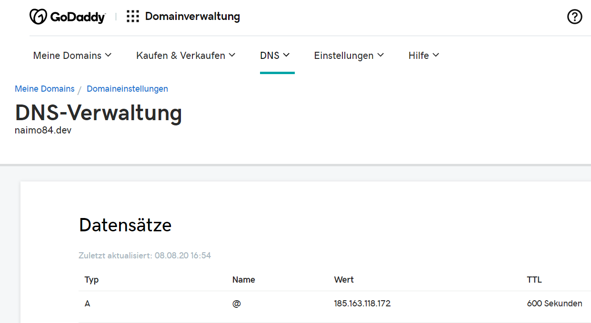

# Node RED godaddy dns

This Node RED module updates your GoDaddy domains with your current public IP (aka DynDNS).

> Node-RED is a tool for wiring together hardware devices, APIs and online services in new and interesting ways.

## :question: Get Help

 For bug reports and feature requests, open issues. :bug: 

## :sparkling_heart: Support my projects

I open-source almost everything I can, and I try to reply to everyone needing help using these projects. Obviously,
this takes time. You can integrate and use these projects in your applications *for free*! You can even change the source code and redistribute (even resell it).

However, if you get some profit from this or just want to encourage me to continue creating stuff, there are few ways you can do it:

 - Starring and sharing the projects you like :rocket:
 - [![PayPal][badge_paypal]][paypal-donations] **PayPal**— You can make one-time donations via PayPal. I'll probably buy a ~~coffee~~ tea. :tea:
 
 - [](https://ko-fi.com/T6T412CXA) **Ko-fi**— I'll buy a ~~tea~~ coffee. :coffee: :wink:
 -  **Bitcoin**—You can send me bitcoins at this address (or scanning the code): `3GqiebqcZeonziRUMYxU35J3jPSMJzpTAc`
 

Thanks! :heart:

## :cloud: Installation

First of all install [Node-RED](http://nodered.org/docs/getting-started/installation)

```sh
$ sudo npm install -g node-red
# Then open  the user data directory  `~/.node-red`  and install the package
$ cd ~/.node-red
$ npm install node-red-contrib-godaddy-dns
```

Or search godaddy in the manage palette menu

Then run

```
node-red
```

## :yum: How to contribute
Have an idea? Found a bug? See [how to contribute][contributing].

```sh
git clone https://github.com/naimo84/node-red-contrib-godaddy-dns.git
cd /path/to/node-red-contrib-godaddy-dns
npm install
gulp
cd ~/.node-red 
npm install /path/to/node-red-contrib-godaddy-dns
```

## :memo: Documentation

### update your DNS entries

Normally I update my dns entries under https://dcc.godaddy.com/manage/naimo84.dev/dns manually. With this nodes, it's done automatically. 



Just enter your domain name, the type (usually A), and the time to live (TTL). With every input your domain's IP will be updated.

You can also enter the values wihtin an input message like this:

msg.payload = {
    newIp: "1.2.3.4"
    entries: {
        domain: "example.com",
        name: "subdomain",
        type: "A",
        ttl: 600
    }
}

You will need to get an API key from https://developer.godaddy.com/keys as well.

## :scroll: The MIT License
Permission is hereby granted, free of charge, to any person obtaining a copy
of this software and associated documentation files (the "Software"), to deal in the Software without restriction, including without limitation the rights to use, copy, modify, merge, publish, distribute, sublicense, and/or sell copies of the Software, and to permit persons to whom the Software is furnished to do so, subject to the following conditions:

The above copyright notice and this permission notice shall be included in
all copies or substantial portions of the Software.

THE SOFTWARE IS PROVIDED "AS IS", WITHOUT WARRANTY OF ANY KIND, EXPRESS OR IMPLIED, INCLUDING BUT NOT LIMITED TO THE WARRANTIES OF MERCHANTABILITY, FITNESS FOR A PARTICULAR PURPOSE AND NONINFRINGEMENT. IN NO EVENT SHALL THE
AUTHORS OR COPYRIGHT HOLDERS BE LIABLE FOR ANY CLAIM, DAMAGES OR OTHER LIABILITY, WHETHER IN AN ACTION OF CONTRACT, TORT OR OTHERWISE, ARISING FROM, OUT OF OR IN CONNECTION WITH THE SOFTWARE OR THE USE OR OTHER DEALINGS IN THE SOFTWARE.

Coded with :heart: in :cloud:


[badge_brave]: ./examples/support_banner.png
[badge_paypal]: https://img.shields.io/badge/Donate-PayPal-blue.svg

[paypal-donations]: https://paypal.me/NeumannBenjamin
[brave]: https://brave.com/nai412
[contributing]: /CONTRIBUTING.md